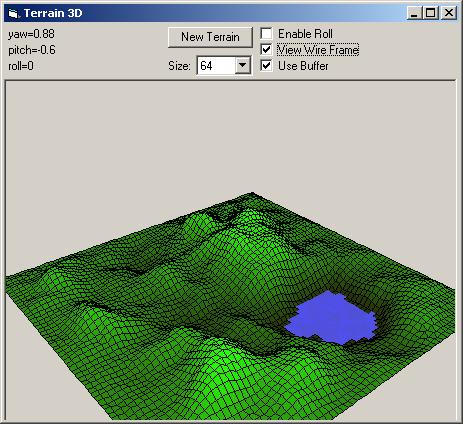



## Terrain 3D \(Improved\)

### Description

Improved is the ability to rotate and move the viewing position without any flickering. This is done by adding a back-buffer routine. Also improved is the ability to select the terrain resolution size at run-time. Also, the back-buffering can be turned on and off at run-time.

Here's the original authors description:

Render a 3D random terrain with gradient colors and water level, rotate and move the viewing position by moving the mouse with left or right button. The example shows how to convert 3D space coordinates to 2D screen coordinates

View the original Terrain 3D here:

http://www.pscode.com/vb/scripts/ShowCode.asp?txtCodeId=64599&amp;lngWId=1
 
### More Info
 

             |
---                |---
**Submitted On**   |2006-03-12 22:00:32
**By**             |[Joshua Robertson](https://github.com/Planet-Source-Code/PSCIndex/blob/master/ByAuthor/joshua-robertson.md)
**Level**          |Advanced
**User Rating**    |5.0 (15 globes from 3 users)
**Compatibility**  |VB 6\.0
**Category**       |[Graphics](https://github.com/Planet-Source-Code/PSCIndex/blob/master/ByCategory/graphics__1-46.md)
**World**          |[Visual Basic](https://github.com/Planet-Source-Code/PSCIndex/blob/master/ByWorld/visual-basic.md)
**Archive File**   |[Terrain\_3D1979863132006\.zip](https://github.com/Planet-Source-Code/joshua-robertson-terrain-3d-improved__1-64644/archive/master.zip)

